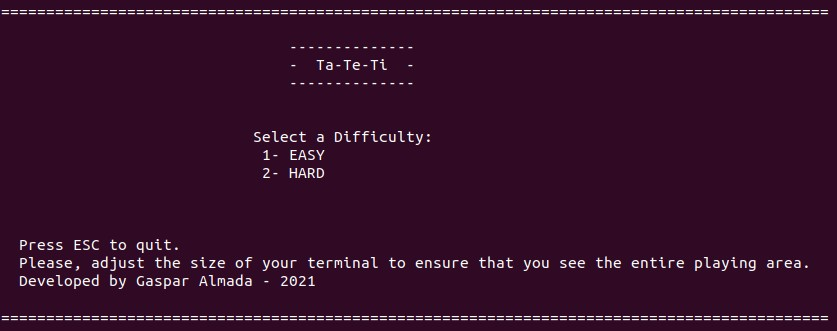
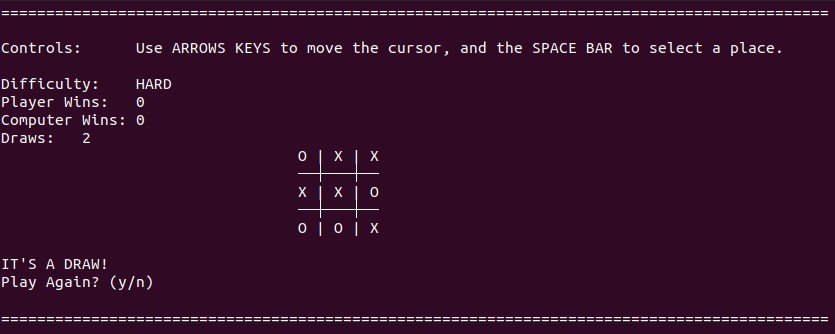

# Ta-Te-Ti

## This project is a version of the Ta-Te-Ti board game, made to run in the terminal.
 
 
Steps to run this project:
<ul>
    <li>Install Go following the official instructions: https://go.dev/doc/install</li>
    <li>Clone this repository on your local disk.</li>
    <li>Open a terminal, and then use it to go to the directory where this repository located.</li>
    <li>Enter 'go run main.go' on your terminal.</li>
</ul>
 
 

## Menu screen:
 

 
 
 

## Game screen:

 
 
 
 

## In this Go project, I made use of the following: 
<ul>
    <li>Use a external package to detect keys pressed on the keyboard.</li>
    <li>Check for errors.</li>
    <li>Go routines.</li>
    <li>String interpolation.</li>
    <li>Generate random numbers.</li>
    <li>Send information between packages.</li>
    <li>Use functions with multiple parameters.</li>
    <li>Modify slices.</li>
</ul>